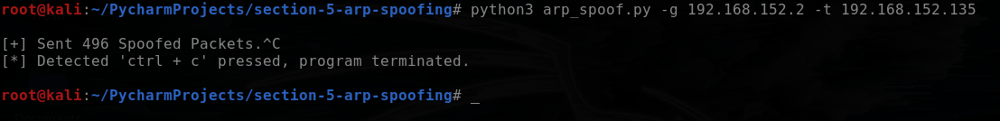

# ARP Spoofing Tool

This Python script is a network security tool that performs ARP (Address Resolution Protocol) spoofing. ARP spoofing is a technique used to manipulate network traffic by sending false ARP responses, allowing an attacker to redirect traffic between two devices.

## Features
- Spoofs ARP packets to manipulate network traffic between target and gateway devices.
- Retrieves MAC addresses associated with IP addresses using ARP requests.
- Restores the ARP tables of target and gateway devices to their original state.
- Command-line interface with options to specify target and gateway IP addresses.

## Requirements
- Python 3.x
- `scapy` library
- `argparse` module

## Usage
1. Clone the repository:
    ```commandline
    git clone https://github.com/SaherMuhamed/arp-spoofing-mitm.git
    ```

2. Navigate to the project directory:
    ```commandline
    cd arp-spoofing-mitm
    ```
   
3. Install the required dependencies:
    ```commandline
    pip install scapy
    ```

4. Run the script with the appropriate command-line options:
    ```commandline
    python3 arp_spoof.py -t <target_ip_address> -g <gateway_ip_address>
    ```
    Replace `<target_ip_address>` with the IP address of the target device and `<gateway_ip_address>` with the IP address of the gateway device.

5. To stop the script, press Ctrl + C. The ARP tables of the target and gateway devices will be restored to their original state.

## Screenshot


## Disclaimer
This tool is intended for educational and testing purposes only. Unauthorized use of this tool on networks or devices without proper authorization is illegal. The developer is not responsible for any misuse or damage caused by this tool.

## Contributing
Contributions are welcome! If you find any issues or have suggestions for improvements, feel free to submit a pull request.

## Acknowledgements
This script was inspired by the concepts of **ARP** spoofing and the usage of the scapy library.

## Contact
For any inquiries or questions, please contact me at sahermuhamed21@gmail.com.
